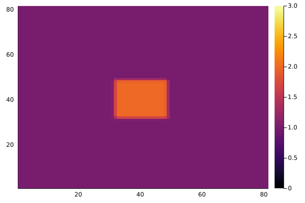

# conv-diff-mp

Solving 2D convection diffusion equation using julia multiprocessing

## Problem

Numerically solving the 2D convection diffusion equation

$$
\frac{\partial{u}}{\partial{t}}+a\frac{\partial{u}}{\partial{x}}+b\frac{\partial{u}}{\partial{y}}=\kappa(\frac{\partial^2{u}}{\partial{x}^2}+\frac{\partial^2{u}}{\partial{y}^2})
$$

under the periodic boundary condition (PBC).

## Finite Difference Method (FDM)

The discretization formula

$$
\frac{u_{i,j}^{n+1}-u_{i,j}^n}{\Delta t}+a \frac{u_{i,j}^n-u_{i-1,j}^n}{\Delta x}+b \frac{u_{i,j}^n-u_{i,j-1}^n}{\Delta y}=\kappa(\frac{u_{i+1,j}^n+u_{i-1,j}^n-2u_{i,j}^n}{\Delta x^2} +\frac{u_{i,j+1}^n+u_{i,j-1}^n-2u_{i,j}^n}{\Delta y^2})
$$

yields

$$
u_{i,j}^{n+1}=k_1 u_{i+1,j}^n+(k_1+k_3)u_{i-1,j}^n+k_2 u_{i,j+1}^n+(k_2+k_4)u_{i,j-1}^n+(1-2k_1-2k_2-k_3-k_4)u_{i,j}^n,
$$

where

$$
k_1=\kappa \frac{\Delta t}{(\Delta x)^2}, \
k_2=\kappa \frac{\Delta t}{(\Delta y)^2}, \
k_3=a \frac{\Delta t}{\Delta x}, \
k_4=b \frac{\Delta t}{\Delta y}. \
$$

## Results

### Visualization
For $a=3,b=3,\kappa=0.001$

### Run time
Testing under 4-core CPU `Intel(R) Core(TM) i5-7300HQ CPU @ 2.50GHz`

| Configuration (nx * ny * dt) | single process | multi process (4) |
| :--------------------------: | :------------: | :---------------: |
|       81 * 81 * 0.001        |   1.229594 s   |    1.317900 s     |
|    8001 * 8001 * 0.00001     |  49.337162 s   |    15.908043 s    |
